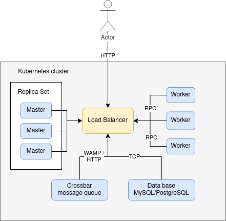

BuildBot multi master helm chart
================================

About BuildBot
--------------

BuildBot is a CI/CD framwork. It is written in python but usable by all
programming languages. One special of BuildBot is, that it can support
multiple master in your setup. That is fundamental  for a high scalability
build farm. Read more about BuildBot on their own Site: 
***[buildbot.net](https://buildbot.net/)***

The concept
-----------

The communication between the the masters and the workers is opened by side
of the worker.  The workers does not knowe that it talks with a load balancer. 
The masters is syncing his state about the database. So it is not important
which master is answering to the worker. But for the masters are all worker 
unique clients. So if two difference worker with the same login
credentials came, it is looking for the masters like a duplicate. That is
the reasons , why we can not have ReplicaSets of workers.

|  |
|-------------------------------------------------------|

If we still want ReplicaSets for workers, we have to put magic in the login
credentials handling. At the moment this is not implemented. But I am open
for suggestions and discussions about this!


Get and configure the chart variables
-------------------------------------

Get variables of the chart:

```bash
helm show values ./helm-charts/buildbot/
```

Set variables of the chart:

Copy origine configuration:

```bash
helm show values ./helm-charts/buildbot/  > config.yaml
```

Modifide the configuration and than:

```bash
$ echo '{mariadbUser: user0, mariadbDatabase: user0db}' > config.yaml
$ helm install -f config.yaml stable/mariadb --generate-name

helm install \
    -f config.yaml \
    --create-namespace \
    -n my-testenv \
    my-test-setup ./helm-charts/buildbot/ 
```

In the file [values.yaml](helm-charts/buildbot/values.yaml) can you find the 
example configuration. It will create a master with two replicas and three
different workers.

Bebuging
--------

If you have trouble with this chart you can use the chart linter:

```bash
[or@augsburg02 buildbot-multi-master-helm-chart]$ helm lint ./helm-charts/buildbot/
==> Linting ./helm-charts/buildbot/

1 chart(s) linted, 0 chart(s) failed
```

Notes and knowed issues
-----------------------

* The volume mount for the master configuration is read only, but the BuildBot 
master need the write exess to its configuration. So it gets only a copy of 
the configuration from the configuration of the volume mount.  This copy will 
be created by the creating of the pod, only one time (without updates in its 
life time).
* No support for worker ReplicaSets in this moment. See section *The concept*.

License note
------------

This code is under MIT license. See [LICENSE](LICENSE)
